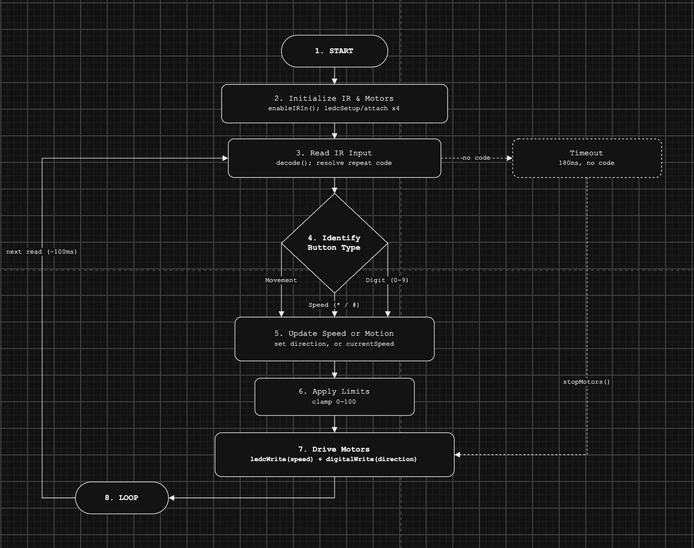

# ESP32 IR Remote Robot Control

An ESP32-based 4-wheel robot that's driven by a standard 21-key NEC IR remote. On top of the original Forward / Backward / Turn / Stop commands, this build adds live speed control: `*` and `#` nudge the speed by 5, and typing digits followed by `0` sets an exact speed (0-100).

## How it works

Every pass through `loop()` does the same eight things, in order:

1. **Start** - boot the sketch.
2. **Initialize IR and motors** - `irrecv.enableIRIn()` brings up the IR receiver, and `ledcSetup()` / `ledcAttachPin()` configure a PWM channel for each of the four motors.
3. **Read IR input** - `irrecv.decode()` grabs the next code. If it's the NEC repeat code (`0xFFFFFFFF`, sent while a button is held), the last real code is reused instead.
4. **Identify button type** - the code is checked against three groups: a **movement** button (Forward / Backward / Turn / Stop), a **speed** button (`*` or `#`), or a **digit** button (`0`-`9`).
5. **Update speed or motion** - movement buttons set the direction pins directly; `*`/`#` adjust `currentSpeed` by ±5; digits build up a typed number in a buffer, which is parsed into `currentSpeed` as soon as `0` is pressed.
6. **Apply limits** - `currentSpeed` is clamped to the 0-100 range no matter which path set it, so a long digit entry (e.g. typing 156) or repeated `#` presses can never overshoot.
7. **Drive motors** - `ledcWrite()` pushes the current speed to all four PWM channels and `digitalWrite()` sets the direction pins, so the change takes effect immediately even if the robot is already moving.
8. **Loop** - back to step 3 for the next reading, roughly every 100ms.

A safety path runs alongside this, independent of any button: if 180ms pass with no new IR code while the motors are running, the sketch calls `stopMotors()` on its own.

### Flowchart



## IR button map

The remote's number pad doesn't share any codes with the movement buttons, so both can be read from the same loop without conflicting:

| Button | Hex code | Role |
|---|---|---|
| Forward | `0xFF18E7` | movement |
| Backward | `0xFF4AB5` | movement |
| Turn left | `0xFF10EF` | movement |
| Turn right | `0xFF5AA5` | movement |
| Stop | `0xFF38C7` | movement |
| `*` | `0xFF6897` | speed − 5 |
| `#` | `0xFFB04F` | speed + 5 |
| `0` | `0xFF9867` | confirm typed speed |
| `1` | `0xFFA25D` | digit |
| `2` | `0xFF629D` | digit |
| `3` | `0xFFE21D` | digit |
| `4` | `0xFF22DD` | digit |
| `5` | `0xFF02FD` | digit |
| `6` | `0xFFC23D` | digit |
| `7` | `0xFFE01F` | digit |
| `8` | `0xFFA857` | digit |
| `9` | `0xFF906F` | digit |

## Demonstration

These codes weren't assumed - they came from reading the actual Serial Monitor output while testing on a FireBeetle-ESP32 board (`/dev/cu.usbserial-0001`), at 115200 baud. A representative capture, pressing `#` a few times and then `0`:

```
FFB04F
FFB04F
FFB04F
FFB04F
FF6897
Speed set -> 100
FF6897
FF6897
FFFFFFFFFFFFFFFF
FF6897
FF6897
FF6897
```

What this showed, and how it shaped the code:

- **`FFB04F` repeating** confirmed `#` on this remote, which fixed a wrong guess based on a generic 21-key reference table (`0xFFA857` was tried first and never matched anything printed).
- **`FF6897` producing `Speed set -> 100`** revealed that `*` and `0` sit in swapped positions compared to that same generic table - `*` sends the code usually documented as `0`, so the digit-confirm logic had to be re-pointed to `0xFF9867` instead.
- **`FFFFFFFFFFFFFFFF`** is the NEC repeat code sent while a button is held down; the sketch resolves it back to the last real code (`lastCode`) rather than treating it as a new, unrecognized button.

A second issue only showed up once the codes were correct: the printed speed value changed, but the motors didn't slow down while already driving. That was because `ledcWrite()` - the call that actually sets PWM duty cycle - only ran inside the movement functions (`moveForward()`, etc.), so a mid-drive speed change updated the variable but never reached the motor driver until the next direction button was pressed. The fix was `applyCurrentSpeed()`, called right after any speed change, which re-writes `currentSpeed` to all four PWM channels without touching the direction pins - so `*`, `#`, and the digit-confirm now change the robot's speed in real time.

## Files

- `robot_ir_speed_control.ino` - the full sketch.
- `flowchart.png` - the rendered flowchart (embedded above).
- `ir_control_flow.drawio` - the same flowchart as an editable draw.io file.

### Demo Video

Watch the robot demonstration here: [Demo video]https://drive.google.com/file/d/1ti69TGnz19EtJ7Q_ZnY_OVJo1EkOq7U7/view?usp=drive_link